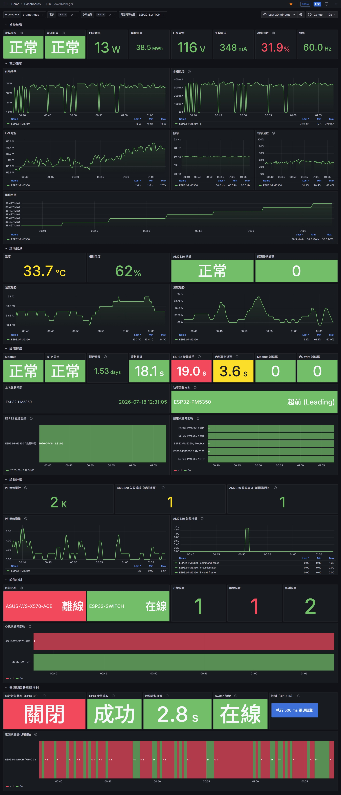
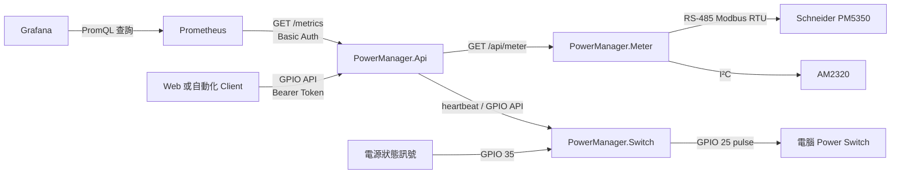
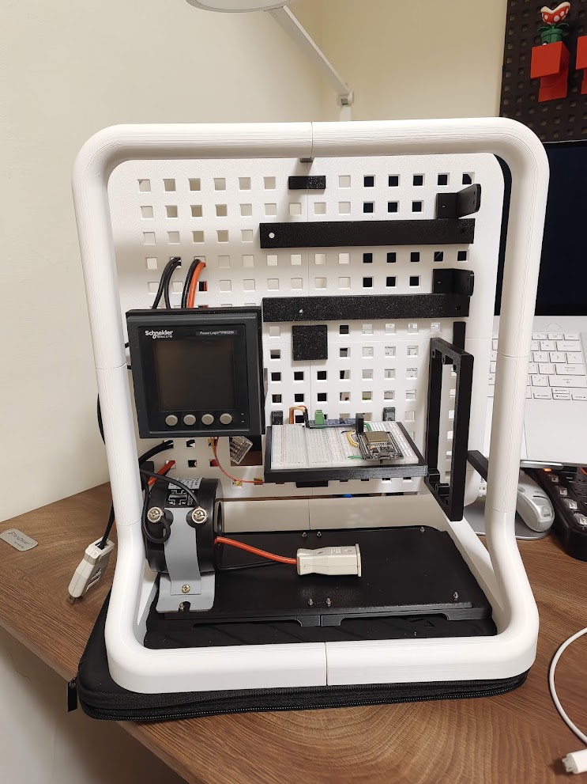
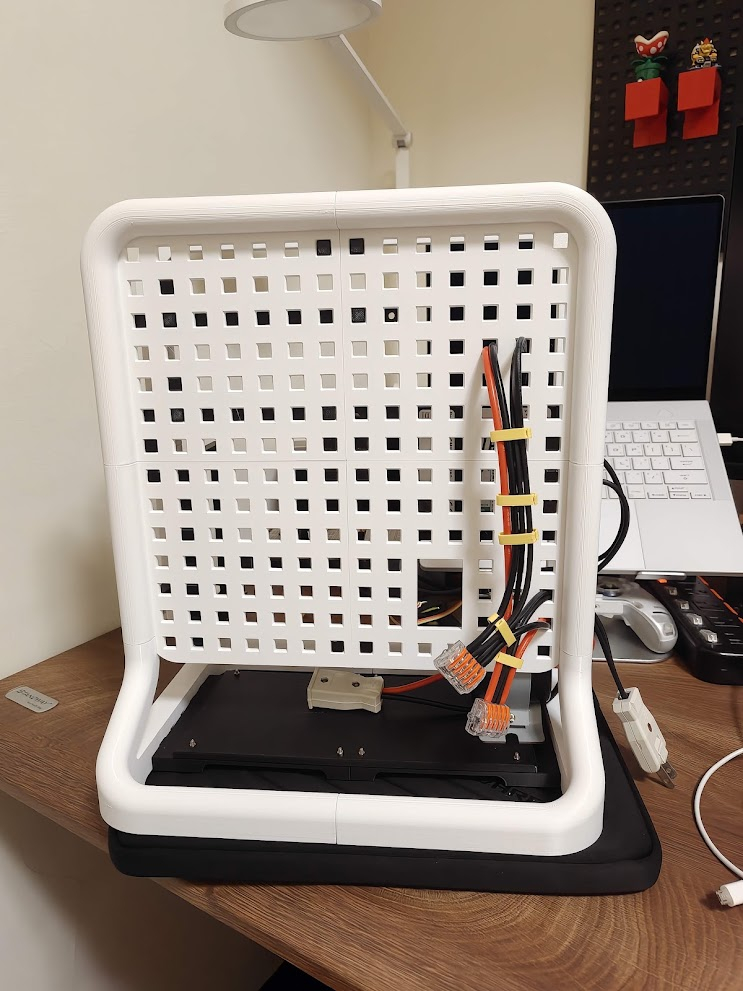
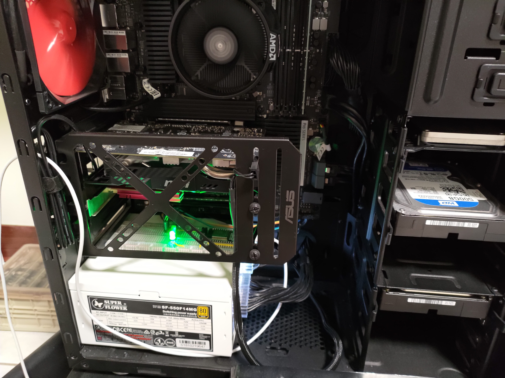
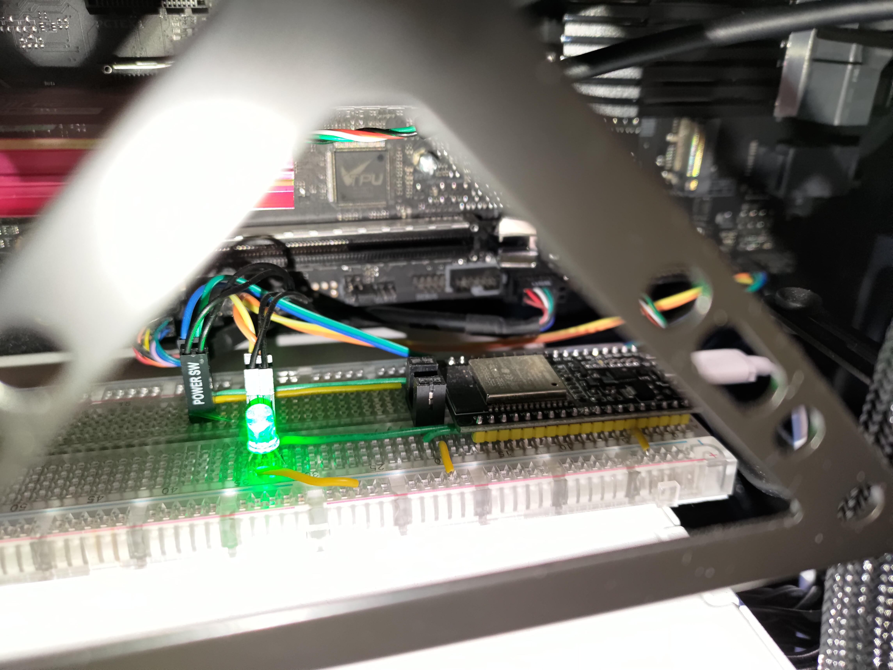

# ATK PowerManager

ATK PowerManager 是一套以 ESP32、Schneider PM5350、Prometheus 與
ASP.NET Core 組成的電力監控與電腦電源控制系統。系統同時收集電力、環境、
裝置健康與 GPIO 狀態，並透過統一的 API 提供監控與控制能力。

<p align="center">
  
</p>

上圖是實際部署的 Grafana 監控畫面，整合 PM5350 電力、AM2320 溫濕度、ESP32
健康狀態、GPIO 狀態與裝置 heartbeat。Grafana Dashboard 由部署環境管理，
repository 不包含 Dashboard JSON。

## 系統架構



監控資料流採 pull model：

1. Grafana 使用 PromQL 向 Prometheus 查詢時間序列。
2. Prometheus 定期以 Basic Auth 抓取 `PowerManager.Api/metrics`。
3. 每次 scrape 時，`PowerManager.Api` 會向 Meter 與 Switch 取得最新資料。
4. Meter 讀取 PM5350 與 AM2320；Switch 回報 heartbeat 與 GPIO 狀態。
5. GPIO 控制走獨立路徑，由 client 攜帶 Bearer Token 呼叫
   `PowerManager.Api`，再由 API 代理到 Switch。

## 元件

| 元件 | 職責 |
| --- | --- |
| `PowerManager.Api` | Web API、裝置代理、驗證、CORS 與 Prometheus exporter |
| `PowerManager.Meter` | 讀取 PM5350 電力與 AM2320 溫濕度，提供 `/api/meter` |
| `PowerManager.Switch` | 監看 GPIO、控制電腦 power switch，提供 heartbeat／read／set／pulse API |
| Prometheus | 定期抓取 `/metrics` 並保存時間序列 |
| Grafana | 查詢 Prometheus 並呈現監控畫面；Dashboard 由部署環境管理 |

## Meter 實機

Meter 節點由 ESP32、RS-485 transceiver、Schneider PM5350 與 AM2320 組成。
ESP32 週期性讀取感測器，在背景維護 Wi-Fi／NTP，HTTP API 則回傳最近一次完整
snapshot。

<table>
  <tr>
    <td width="50%"></td>
    <td width="50%"></td>
  </tr>
  <tr>
    <td align="center">Meter 正面：PM5350、ESP32 與感測電路</td>
    <td align="center">Meter 背面：電力與通訊配線</td>
  </tr>
</table>

主要資料包括：

- L-N 電壓、各相電流、平均電流、總有效功率與頻率
- 功率因數、leading／lagging 狀態與累積有效電能
- AM2320 溫度、相對濕度與讀取診斷
- Modbus 狀態、NTP 狀態、uptime、boot time 與 retry counters

Meter HTTP API 本身不做驗證，適合放在受信任 LAN，由 `PowerManager.Api` 統一
對外提供監控資料。

## Switch 實機

Switch 節點安裝於電腦機殼內，由 ESP32 監看電源狀態並模擬實體 power switch。
目前 GPIO `35` 作為狀態輸入，GPIO `25` 作為控制輸出。

<table>
  <tr>
    <td width="50%"></td>
    <td width="50%"></td>
  </tr>
  <tr>
    <td align="center">Switch 在電腦機殼內的安裝位置</td>
    <td align="center">ESP32 與 GPIO 控制配線</td>
  </tr>
</table>

Switch 支援：

- `GET /api/heartbeat`：裝置存活狀態
- `GET /api/gpio`：讀取允許的 input／output pin
- `POST /api/gpio`：持續設定 output pin
- `POST /api/gpio/pulse`：在指定時間內模擬按下電源按鈕，再恢復原狀態

Switch API 只在 Wi-Fi 已連線時啟動。對外控制應經由 `PowerManager.Api`，由
Bearer Token 保護 GPIO endpoint。

## 快速設定

### 1. Meter

```powershell
Copy-Item src/PowerManager.Meter/MeterConfig.example.h src/PowerManager.Meter/MeterConfig.h
```

在本機 `MeterConfig.h` 設定 Wi-Fi、hostname、pins、Modbus 與感測器參數。此檔
已由 Git 忽略。

### 2. Switch

```powershell
Copy-Item src/PowerManager.Switch/SwitchSecrets.example.h src/PowerManager.Switch/SwitchSecrets.h
```

在本機 `SwitchSecrets.h` 設定 Wi-Fi 與 hostname。GPIO allowlist 位於
`SwitchConfiguration.h`。

### 3. PowerManager.Api

`src/PowerManager.Api/appsettings.json` 定義 Meter、Switch、heartbeat、CORS 與
開發環境設定。正式環境資訊建議透過 ASP.NET Core 環境變數覆寫：

```text
MetricsBasicAuth__Username=<username>
MetricsBasicAuth__Password=<password>
GpioBearerToken__Token=<至少 32 字元的 token>
```

啟動 API：

```powershell
dotnet run --project src/PowerManager.Api/PowerManager.Api.csproj
```

### 4. Prometheus

```yaml
scrape_configs:
  - job_name: power-manager
    static_configs:
      - targets: ["localhost:8920"]
    basic_auth:
      username: <username>
      password: <password>
```

將 Grafana datasource 指向這個 Prometheus，即可使用 PromQL 建立監控畫面。

## 專案結構

```text
ATK_PowerManager/
├─ assets/readme/              README 圖片
├─ doc/                        API、Meter、Switch 文件
├─ src/PowerManager.Api/       ASP.NET Core API 與 Prometheus exporter
├─ src/PowerManager.Domain/    Domain models 與 options
├─ src/PowerManager.Repositories/
├─ src/PowerManager.Meter/     PM5350／AM2320 ESP32 firmware
└─ src/PowerManager.Switch/    GPIO switch ESP32 firmware
```

## 文件

- [PowerManager.Api](doc/PowerManager.Api.md)
- [PowerManager.Meter](doc/PowerManager.Meter.md)
- [PowerManager.Switch](doc/PowerManager.Switch.md)

## License

本專案依 [GNU General Public License v3.0](LICENSE) 授權。
